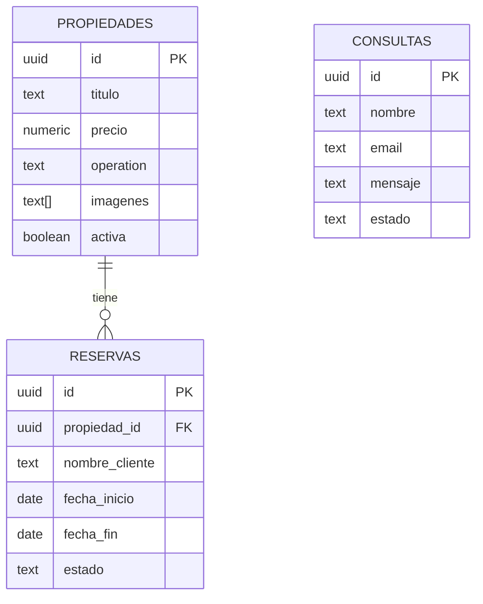

# 🏠 Braidot Inmobiliaria - Sistema de Gestión Inmobiliaria

[](https://react.dev)
[](https://vitejs.dev)
[](https://tailwindcss.com)
[](https://supabase.com)
[](https://vercel.com)

Sistema web completo y **producción-ready** para gestión integral de propiedades inmobiliarias. Desarrollado con arquitectura moderna, diseño mobile-first y experiencia de usuario premium.

> **Estado del Proyecto:** ✅ **PRODUCCIÓN-READY**  
> **Última Actualización:** 27/12/2025  
> **Desarrollado por:** [Neocode Innovation](https://github.com/kevinramirezok) 🚀

---

## 📋 Tabla de Contenidos

- [✨ Introducción](#-introducción)
- [🛠️ Stack Tecnológico](#️-stack-tecnológico)
- [🎯 Características Principales](#-características-principales)
- [🏗️ Arquitectura y Diseño](#️-arquitectura-y-diseño)
- [📐 Lógica de Negocio](#-lógica-de-negocio)
- [🗄️ Base de Datos](#️-base-de-datos)
- [🔐 Seguridad y Políticas RLS](#-seguridad-y-políticas-rls)
- [⚡ Instalación y Configuración](#-instalación-y-configuración)
- [📁 Estructura del Proyecto](#-estructura-del-proyecto)
- [🎨 Funcionalidades Detalladas](#-funcionalidades-detalladas)
- [👨‍💼 Panel Administrativo](#-panel-administrativo)
- [🚀 Deploy en Vercel](#-deploy-en-vercel)
- [📞 Contacto y Soporte](#-contacto-y-soporte)
✨ Introducción

**Braidot Inmobiliaria** es una plataforma web completa diseñada para revolucionar la gestión de propiedades inmobiliarias. Con una identidad visual distintiva basada en el color **Bordo (#5B0F0F)**, el sistema ofrece una experiencia premium tanto para clientes como para administradores.

### 🎨 Identidad Visual
El proyecto utiliza una paleta de colores cuidadosamente seleccionada:
- **Primario:** Bordo `#5B0F0F` - Color distintivo dmulti-criterio  
✅ **Sistema de reservas** con calendario interactivo y lógica de quintas  
✅ **Comparador de propiedades** (hasta 3 simultáneas) con análisis comparativo  
✅ **Formulario de consultas** con notificaciones toast profesionales  
✅ **Botón flotante de WhatsApp** con deep linking (+54 9 3482 30-5750)  
✅ **Lightbox de imágenes** con visualización completa sin recortes (`object-contain`)  
✅ **Tabs dinámicos** para venta, alquiler y propiedades temporarias  
✅ **Diseño mobile-first** optimizado desde 320px hasta 4K  
✅ **Notificaciones react-hot-toast** con color bordo (#5B0F0F)  
✅ **Jerarquía z-index** sin conflictos (Navbar: 40, Modales: 50, Lightbox: 200)

### 🔧 Panel Administrativo
✅ **Autenticación segura** con JWT y session persistente  
✅ **Dashboard** con métricas en tiempo real y estadísticas visuales  
✅ **CRUD de propiedades** con validación exhaustiva  
✅ **Sistema de prefixing** para orden de imágenes (00-, 01-, 02-)  
✅ **Bloqueo manual** de fechas con reservas administrativas (`ADMIN_BLOCK`)  
✅ **Eliminación de reservas** con confirmación toast personalizada  
✅ **Sincronización perfecta** con base de datos (columnas exactas)  
✅ **Gestión de reservas** con filtros, búsqueda y cambios de estado
{
  "framework": "React 18.2.0",           // UI Library con Hooks
  "styling": "Tailwind CSS 3.0.0",      // Utility-first CSS
  "routing": "React Router DOM 7.9.6",  // Client-side routing
  "notifications": "react-hot-toast 2.6.0", // Sistema de toasts
  "build": "Vite 5.4.0"                 // Build tool ultrarrápido
}
```

### Backend & Servicios
```javascript
{
  "platform": "Supabase 2.84.0",        // Backend as a Service
  "database": "PostgreSQL",             // Base de datos relacional
  "auth": "Supabase Auth",              // Autenticación JWT
  "storage": "Supabase Storage",        // Almacenamiento de imágenes
  "realtime": "Supabase Realtime"       // Subscripciones en tiempo real
}
```

### Herramientas de Desarrollo
- **PostCSS 8.0.0** - Procesamiento de CSS
- **Autoprefixer 10.0.0** - Compatibilidad cross-browser
- **dotenv 17.2.3** - Gestión de variables de entorno

---

## 
---

## 🎯 Características Principales

### 🌐 Funcionalidades Públicas
✅ **Catálogo de propiedades** con filtros avanzados (ubicación, tipo, precio, habitaciones, patio)  
✅ **Sistema de reservas** con calendario interactivo y validación de disponibilidad  
✅ **Comparador de propiedades** (hasta 3 simultáneas) con tabla comparativa detallada  
✅ **Formulario de consultas** con almacenamiento en Supabase  
✅ **Botón flotante de WhatsApp** con mensaje predefinido (+54 9 3482 30-5750)  
✅ **Interfaz moderna** con Tailwind CSS, glassmorphism y animaciones fluidas  
✅ **Tabs dinámicos** para venta, alquiler y propiedades temporarias  
✅ **Diseño responsive** optimizado para móviles, tablets y desktop  

### 🔧 Panel Administrativo
✅ **Autenticación segura** con Supabase Auth  
✅ **Dashboard** con estadísticas en tiempo real (propiedades, reservas, consultas)  
✅ **CRUD completo de propiedades** con editor visual  
✅ **Carga de imágenes** por URL o subida directa a Supabase Storage  
✅ **Gestión de reservas** (aprobar, rechazar, cancelar) con filtros y búsqueda  
✅ **Vista detallada** de cada reserva con información del cliente y propiedad  
✅ **Sidebar de navegación** intuitivo con íconos  

---

## 🏗️ Arquitectura y Diseño

### 🎨 Diseño Mobile-First
El proyecto está optimizado para funcionar perfectamente desde **320px de ancho** (iPhone SE) hasta pantallas 4K:

```css
/* Breakpoints responsivos */
320px  → Mobile (base)
640px  → sm (tablets pequeñas)
768px  → md (tablets)
1024px → lg (laptops)
1280px → xl (desktops)
1536px → 2xl (monitores grandes)
```

### 🖼️ Lightbox de Imágenes
**Ubicación:** `PropertyModal.jsx`

Características técnicas:
- **`z-index: 200`** - Máxima prioridad visual
- **`object-fit: contain`** - Imágenes completas sin recortes
- **Controles:**
  - Tecla **ESC** para cerrar
  - Click fuera del área para cerrar
  - Flechas de navegación entre imágenes
  - Backdrop con `blur-md`

```javascript
// Implementación del Lightbox
 e.stopPropagation()}
/>
```

### 🎯 Sistema de Notificaciones (react-hot-toast)
**Estado:** ✅ 100% implementado - **0 `window.alert()` en el código**

Configuración global en `App.jsx`:
```javascript
<Toaster 
  position="top-center"
  toastOptions={{
    style: {
      background: '#ffffff',
      color: '#0b0b0b',
      borderRadius: '12px',
      boxShadow: '0 10px 40px rgba(91, 15, 15, 0.2)',
    },
    success: {
      iconTheme: {
        primary: '#5B0F0F',  // Color bordo de la marca
        secondary: '#ffffff',
      },
      style: {
        border: '2px solid #5B0F0F',
      },
    },
  }}
/>
```

**Archivos actualizados:**
- `ModalReserva.jsx` - Confirmaciones y errores de reserva
- `FormularioContacto.jsx` - Envío de consultas
- `ReservasAdmin.jsx` - Operaciones CRUD con confirmación personalizada
- `PropiedadesAdmin.jsx` - Gestión de propiedades
- `FormularioPropiedad.jsx` - Carga de imágenes con progress
- `CompareContext.jsx` - Feedback del comparador

### 📐 Jerarquía Z-Index Estandarizada

```css
/* Sin conflictos visuales - Probado exhaustivamente */
Navbar:         z-40      /* Fijo en la parte superior */
WhatsAppFloat:  z-30      /* Botón flotante inferior derecha */
AdminButton:    z-30      /* Acceso admin inferior izquierda */
CompareBar:     z-40      /* Barra flotante de comparación */
Modales:        z-50      /* PropertyModal, Modal de Bloqueo */
ModalReserva:   z-[99999] /* Modal de reserva máxima prioridad */
Lightbox:       z-[200]   /* Visualización full-screen de imágenes */
```

---

## 📐 Lógica de Negocio

### 🏡 Lógica de Quintas (Alquiler Temporario)

**Concepto:** Las quintas se alquilan por **días completos**, no por noches. El cálculo incluye tanto el día de entrada como el de salida.

**Fórmula Aplicada:**
```javascript
cantidad_dias = (fecha_fin - fecha_inicio) + 1
```

**Implementación en `ModalReserva.jsx` (Línea 64-77):**
```javascript
const calcularCantidad = () => {
  if (!fechaInicio || !fechaFin) return 0;
  const diff = fechaFin - fechaInicio;
  const dias = Math.ceil(diff / (1000 * 60 * 60 * 24));
  
  // QUINTA: Se cobra por DÍA (incluye entrada Y salida)
  if (property.tipo === "Quinta") {
    return dias + 1;  // ✅ FÓRMULA CORRECTA
  }
  
  // ESTADÍA (Casa, Cabaña, Depto): Se cobra por NOCHE
  return dias === 0 ? 1 : dias;
};
```

**Implementación en `ReservasAdmin.jsx` - Bloqueo Manual (Línea 122-125):**
```javascript
const inicio = new Date(formBloqueo.fecha_inicio);
const fin = new Date(formBloqueo.fecha_fin);
const diffTime = Math.abs(fin - inicio);
const cantidadDias = Math.ceil(diffTime / (1000 * 60 * 60 * 24)) + 1;  // ✅
```

**Ejemplos de Cálculo:**

| Fecha Entrada | Fecha Salida | Diferencia | **Resultado Quinta** | Resultado Estadía |
|---------------|--------------|------------|----------------------|-------------------|
| 27/12/2025 | 27/12/2025 | 0 días | **1 día** ✅ | 1 noche |
| 27/12/2025 | 28/12/2025 | 1 día | **2 días** ✅ | 1 noche |
| 30/12/2025 | 31/12/2025 | 1 día | **2 días** ✅ | 1 noche |
| 27/12/2025 | 31/12/2025 | 4 días | **5 días** ✅ | 4 noches |

**Almacenamiento en Base de Datos:**
```sql
-- Tabla: reservas
-- Columna: cantidad_noches (INT)
-- Nota: Para quintas, almacena DÍAS (no noches)
```

### 📸 Sistema de Prefixing de Imágenes

**Problema Original:** Supabase Storage ordena alfabéticamente, perdiendo el orden de selección del usuario.

**Solución Implementada:** Prefixing numérico automático

**Ubicación:** `FormularioPropiedad.jsx` (Línea 125)

```javascript
// Generar prefijo con padding de ceros
const indiceFormateado = i.toString().padStart(2, '0');

// Formato final: 00-nombre-timestamp-randomId.ext
const fileName = `${indiceFormateado}-${nombreSanitizado}-${timestamp}-${randomId}.${fileExt}`;
```

**Ejemplo de Nomenclatura:**
```
00-casa-moderna-1735324800-abc123.jpg
01-vista-frontal-1735324800-def456.jpg
02-cocina-equipada-1735324800-ghi789.jpg
03-dormitorio-principal-1735324800-jkl012.jpg
```

**Beneficios:**
- ✅ Orden alfabético = orden cronológico
- ✅ Máximo 99 imágenes por propiedad (00-99)
- ✅ Timestamp evita colisiones
- ✅ Random ID para seguridad adicional

---

## 🗄️ Base de Datos

### Frontend
| Tecnología | Versión | Descripción |
|------------|---------|-------------|
| **React** | 18.2.0 | Biblioteca JavaScript para interfaces de usuario |
| **React Router DOM** | 7.9.6 | Enrutamiento declarativo para aplicaciones React |
| **Tailwind CSS** | 3.0.0 | Framework CSS utility-first para diseño moderno |
| **Vite** | 5.4.0 | Build tool de nueva generación (downgraded para Vercel) |

### Backend & Servicios
| Tecnología | Versión | Descripción |
|------------|---------|-------------|
| **Supabase** | 2.84.0 | Backend as a Service (BaaS) |
| ↳ PostgreSQL | - | Base de datos relacional |
| ↳ Auth | - | Sistema de autenticación |
| ↳ Storage | - | Almacenamiento de imágenes |
| ↳ Realtime | - | Subscripciones en tiempo real |

### Herramientas de Desarrollo
| Tecnología | Versión | Descripción |
|------------|---------|-------------|
| **PostCSS** | 8.0.0 | Procesador de CSS con plugins |
| **Autoprefixer** | 10.0.0 | Prefijos CSS automáticos para compatibilidad |
| **dotenv** | 17.2.3 | Gestión de variables de entorno |

---

## 📁 Estructura del Proyecto

```
braidot_inmobiliaria/
│
├── 📂 public/                          # Archivos públicos estáticos
│   ├── FONDO1.jpg                      # Imagen de fondo admin (Dashboard)
│   └── FONDO2.jpg                      # Imagen de fondo admin (Propiedades/Reservas)
│
├── 📂 src/                             # Código fuente principal
│   │
│   ├── 📂 admin/                       # Módulos administrativos legacy
│   │   └── ManageReservations.jsx      # Componente gestión reservas (legacy)
│   │
│   ├── 📂 assets/                      # Recursos estáticos
│   │   └── 📂 images/                  # Imágenes locales (FONDO1.jpg, FONDO2.jpg)
│   │
│   ├── 📂 components/                  # Componentes reutilizables
│   │   ├── 📂 admin/                   # Componentes exclusivos del admin
│   │   │   └── FormularioPropiedad.jsx # Formulario CRUD de propiedades
│   │   │
│   │   ├── AdminSidebar.jsx            # Sidebar del panel admin
│   │   ├── Calendar.jsx                # Componente calendario genérico
│   │   ├── CalendarioReservas.jsx      # Calendario con lógica de reservas
│   │   ├── CompareBar.jsx              # Barra flotante de comparación
│   │   ├── Footer.jsx                  # Footer del sitio público
│   │   ├── FormularioContacto.jsx      # Formulario de consultas
│   │   ├── ModalReserva.jsx            # Modal para crear reservas
│   │   ├── ModernTabs.jsx              # Tabs estilizados (venta/alquiler/temporaria)
│   │   ├── Navbar.jsx                  # Barra de navegación principal
│   │   ├── PropertyCard.jsx            # Tarjeta de propiedad con hover effects
│   │   ├── PropertyFilter.jsx          # Filtros avanzados de propiedades
│   │   ├── PropertyModal.jsx           # Modal de detalles de propiedad
│   │   ├── ReservationForm.jsx         # Formulario de reserva
│   │   ├── Testimonials.jsx            # Sección de testimonios
│   │   ├── WhatsappFloat.jsx           # Botón flotante de WhatsApp
│   │   └── WhyChooseUs.jsx             # Sección "Por qué elegirnos"
│   │
│   ├── 📂 contexts/                    # Contextos de React
│   │   ├── AuthContext.jsx             # Contexto de autenticación global
│   │   └── CompareContext.jsx          # Contexto del comparador de propiedades
│   │
│   ├── 📂 data/                        # Datos estáticos
│   │   └── properties.json             # JSON con propiedades mock (legacy)
│   │
│   ├── 📂 lib/                         # Configuraciones y utilidades
│   │   └── supabase.js                 # Cliente de Supabase configurado
│   │
│   ├── 📂 pages/                       # Páginas principales
│   │   ├── 📂 admin/                   # Páginas del panel administrativo
│   │   │   ├── Dashboard.jsx           # Dashboard con estadísticas
│   │   │   ├── Login.jsx               # Página de login admin
│   │   │   ├── PropiedadesAdmin.jsx    # Gestión de propiedades
│   │   │   └── ReservasAdmin.jsx       # Gestión de reservas
│   │   │
│   │   ├── Comparar.jsx                # Página del comparador
│   │   ├── Home.jsx                    # Página de inicio
│   │   └── PropiedadesPorCategoria.jsx # Listado por categoría
│   │
│   ├── 📂 services/                    # Servicios de datos
│   │   └── propertyService.js          # Servicio de propiedades (API Supabase)
│   │
│   ├── App.jsx                         # Componente raíz con rutas
│   ├── index.css                       # Estilos globales + Tailwind
│   └── main.jsx                        # Punto de entrada de React
│
├── 📄 .env.local                       # Variables de entorno (NO versionar)
├── 📄 .gitignore                       # Archivos ignorados por Git
├── 📄 BASEDEDATOS.txt                  # Script SQL de estructura de base de datos
├── 📄 index.html                       # HTML base
├── 📄 package.json                     # Dependencias y scripts
├── 📄 package-lock.json                # Lock de dependencias
├── 📄 postcss.config.cjs               # Configuración PostCSS
├── 📄 proximos pasos.txt               # Notas de desarrollo
├── 📄 README.md                        # Este archivo
├── 📄 tailwind.config.js               # Configuración de Tailwind CSS
└── 📄 vite.config.js                   # Configuración de Vite
```

### 📊 Estadísticas del Proyecto
- **Total de componentes React:** 22
- **Total de páginas:** 7 (4 públicas + 3 admin)
- **Total de contextos:** 2 (Auth, Compare)
- **Total de servicios:** 1 (propertyService)
- **Líneas de código:** ~7,500+

---

## ⚡ Instalación y Configuración

### 1️⃣ Requisitos Previos

- **Node.js** ≥ 18.x
- **npm** o **yarn**
- Cuenta en **Supabase** (https://supabase.com)
- Proyecto de Supabase creado con tablas configuradas

---

### 2️⃣ Instalación Local

```bash
# Clonar repositorio
git clone https://github.com/tu-usuario/braidot-inmobiliaria.git
cd braidot-inmobiliaria

# Instalar dependencias
npm install

# Configurar variables de entorno
cp .env.example .env
```

---

### 3️⃣ Configuración de Variables de Entorno

Crear archivo `.env` en la raíz del proyecto:

```env
# Supabase Configuration
VITE_SUPABASE_URL=https://tu-proyecto.supabase.co
VITE_SUPABASE_ANON_KEY=tu-anon-key-aqui

# Admin Credentials (para testing local)
VITE_ADMIN_EMAIL=admin@braidot.com
VITE_ADMIN_PASSWORD=tu-password-seguro
```

**¿Dónde encontrar las credenciales de Supabase?**
1. Ir a [app.supabase.com](https://app.supabase.com)
2. Seleccionar tu proyecto
3. Ir a **Settings** → **API**
4. Copiar:
   - **Project URL** → `VITE_SUPABASE_URL`
   - **anon public** key → `VITE_SUPABASE_ANON_KEY`

---

### 4️⃣ Configurar Base de Datos en Supabase

#### Paso 1: Crear Tablas

Ejecutar en **SQL Editor** de Supabase:

```sql
-- Ver sección 🗄️ Base de Datos para el esquema completo
-- Copiar y ejecutar los CREATE TABLE de propiedades, reservas y consultas
```

#### Paso 2: Ejecutar Políticas RLS

**OBLIGATORIO para que funcione el formulario de reservas público:**

```sql
-- Ver sección 🔐 Seguridad y Políticas RLS
-- Copiar y ejecutar el script completo de SOLUCION_RLS_RESERVAS.sql
```

#### Paso 3: Crear Bucket de Storage

```sql
-- Crear bucket para imágenes de propiedades
INSERT INTO storage.buckets (id, name, public)
VALUES ('propiedades-imagenes', 'propiedades-imagenes', true);

-- Políticas de storage (lectura pública, escritura autenticada)
-- Ver sección 🛡️ Seguridad Adicional
```

#### Paso 4: Crear Usuario Admin

```sql
-- Ejecutar en Authentication → Users → Add User
-- O desde SQL:
INSERT INTO auth.users (email, encrypted_password)
VALUES (
  'admin@braidot.com',
  crypt('tu-password-seguro', gen_salt('bf'))
);
```

---

### 5️⃣ Ejecutar en Desarrollo

```bash
# Iniciar servidor de desarrollo (Vite)
npm run dev

# Abrir en navegador
# http://localhost:5173
```

**Verificaciones:**
- ✅ Home page carga correctamente
- ✅ Filtros de propiedades funcionan
- ✅ Formulario de reserva se abre (no debería dar error 42501)
- ✅ Lightbox de imágenes funciona
- ✅ Toast notifications se muestran (sin window.alert)

---

### 6️⃣ Compilar para Producción

```bash
# Generar build optimizado
npm run build

# Vista previa del build
npm run preview
```

**Output:**
```
dist/
  ├── index.html
  ├── assets/
  │   ├── index-[hash].js        # Bundle JS minificado
  │   ├── index-[hash].css       # CSS optimizado
  │   └── images/                # Imágenes optimizadas
  └── ...
```

---

### 7️⃣ Deploy en Vercel

#### Opción A: Deploy desde Git

1. Conectar repositorio en [vercel.com](https://vercel.com)
2. Configurar variables de entorno en Vercel:
   - Settings → Environment Variables
   - Agregar `VITE_SUPABASE_URL` y `VITE_SUPABASE_ANON_KEY`
3. Deploy automático

#### Opción B: Deploy Manual

```bash
# Instalar Vercel CLI
npm install -g vercel

# Deploy
vercel --prod
```

**Archivo `vercel.json` (ya incluido en el proyecto):**
```json
{
  "buildCommand": "npm run build",
  "outputDirectory": "dist",
  "framework": "vite",
  "rewrites": [
    {
      "source": "/(.*)",
      "destination": "/index.html"
    }
  ]
}
```

---

## 🧪 Testing y Verificación

### Checklist Post-Deployment

#### Frontend Público
- [ ] Home page carga sin errores de consola
- [ ] Filtros de propiedades funcionan (Venta/Alquiler/Temporaria)
- [ ] Cards de propiedades muestran imágenes correctamente
- [ ] Lightbox abre imágenes en orden correcto (00-, 01-, 02-)
- [ ] Lightbox usa `object-contain` (imágenes completas sin recorte)
- [ ] Formulario de reserva se abre correctamente
- [ ] Formulario de reserva NO da error 42501
- [ ] Toast notifications funcionan (sin window.alert)
- [ ] Formulario de contacto envía consultas a DB
- [ ] WhatsApp float button funciona
- [ ] Responsive en móviles (320px+)

#### Panel Admin
- [ ] Login funciona con credenciales correctas
- [ ] Dashboard muestra estadísticas reales
- [ ] Gestión de propiedades (CRUD completo)
- [ ] Subida de imágenes con prefixing (00-, 01-)
- [ ] Gestión de reservas (cambio de estado)
- [ ] Bloqueo manual de fechas funciona
- [ ] Botón "Eliminar" reserva funciona
- [ ] Cierre de sesión redirige al login

#### Base de Datos
- [ ] Tablas `propiedades`, `reservas`, `consultas` existen
- [ ] Políticas RLS están activas
- [ ] Columnas sincronizadas: `nombre_cliente`, `notas`, `cantidad_personas`, `cantidad_noches`
- [ ] Bucket de storage `propiedades-imagenes` existe
- [ ] Imágenes se suben y sirven correctamente

---

## 🐛 Troubleshooting

### Error 42501: Permission Denied

**Síntoma:**
```
Error: new row violates row-level security policy for table "reservas"
Code: 42501
```

**Solución:**
Ejecutar el script completo de la sección **🔐 Seguridad y Políticas RLS**.

---

### Imágenes no se muestran en propiedades

**Causa 1:** Bucket de storage no es público.

**Solución:**
```sql
UPDATE storage.buckets
SET public = true
WHERE id = 'propiedades-imagenes';
```

**Causa 2:** Políticas de storage no están configuradas.

**Solución:** Ver sección **🛡️ Seguridad Adicional** para políticas de storage.

---

### Toast notifications no aparecen

**Verificar:** Componente `<Toaster />` está incluido en `App.jsx`:

```jsx
import { Toaster } from 'react-hot-toast';

function App() {
  return (
    <>
      <Toaster 
        position="top-center"
        toastOptions={{
          duration: 4000,
          style: {
            background: '#5B0F0F',  // Bordo brand color
            color: '#fff',
          },
        }}
      />
      {/* resto de la app */}
    </>
  );
}
```

---

### Lógica de Quintas calcula mal las noches

**Verificar:** La fórmula usa `+ 1`:

```javascript
// CORRECTO (para quintas por día)
const cantidad_dias = Math.ceil(diffTime / (1000 * 60 * 60 * 24)) + 1;

// INCORRECTO (para hoteles por noche)
const cantidad_noches = Math.ceil(diffTime / (1000 * 60 * 60 * 24));
```

---

### Imágenes aparecen en orden incorrecto

**Verificar:** Sistema de prefixing está activo en `FormularioPropiedad.jsx`:

```javascript
const indiceFormateado = i.toString().padStart(2, '0');
const fileName = `${indiceFormateado}-${nombreSanitizado}-${timestamp}-${randomId}.${fileExt}`;
```

Orden alfabético = orden cronológico:
```
00-sala-timestamp.jpg   ← Primera imagen
01-cocina-timestamp.jpg ← Segunda imagen
02-bano-timestamp.jpg   ← Tercera imagen
```

---

### Z-index: Modal se oculta detrás de Navbar

**Verificar jerarquía:**

```css
/* Navbar */
.navbar { z-index: 40; }

/* Modales generales */
.modal { z-index: 50; }

/* Lightbox de imágenes */
.lightbox { z-index: 200; }
```

---

En Supabase Dashboard:
1. Storage → Create Bucket
2. Nombre: `property-images`
3. Public bucket: ✅ Sí
4. File size limit: 5MB

#### 6. Iniciar servidor de desarrollo
```bash
npm run dev
```

🎉 El proyecto estará disponible en: **http://localhost:5173**

---

## 🎨 Funcionalidades Detalladas

### 1️⃣ Catálogo de Propiedades

**Ubicación:** Página principal (`src/pages/Home.jsx`)

**Características:**
- **Tabs dinámicos** para separar por operación (Venta, Alquiler, Temporaria)
- **Filtros avanzados:**
  - 📍 Ubicación (localidad)
  - 🚪 Cantidad de ambientes (1, 2, 3, 4+)
  - 🏠 Tipo de propiedad (Casa, Departamento, Local, Terreno, etc.)
  - 🌳 Con/sin patio
  - 💰 Precio máximo
- **Tarjetas de propiedades** con:
  - Imagen principal con hover zoom
  - Badge de operación (Venta/Alquiler/Temporaria)
  - Precio destacado
  - Ubicación, ambientes, baños, cocheras
  - Botón "Ver Detalles"
  - **Botón de comparación** (agregar hasta 3 propiedades)
- **Botón "Ver Todos"** para categoría completa

**Tecnologías:**
- React Hooks (`useState`, `useEffect`)
- Context API (CompareContext)
- Tailwind CSS con efectos glassmorphism

---

### 2️⃣ Sistema de Reservas

**Ubicación:** Modal de reserva (`src/components/ModalReserva.jsx`)

**Flujo de reserva:**

**Paso 1: Selección de fechas**
- Calendario interactivo con:
  - ✅ Fechas disponibles (verdes)
  - ❌ Fechas ocupadas (rojas)
  - 🟡 Rango seleccionado (amarillo)
- Navegación por meses
- Validación:
  - No permite fechas pasadas
  - Bloquea fechas con reservas PENDIENTES o CONFIRMADAS
  - Mínimo 1 noche

**Paso 2: Formulario de datos**
- Campos requeridos:
  - 👤 Nombre completo
  - 📧 Email
  - 📱 Teléfono
  - 👥 Cantidad de personas
  - 💬 Mensaje (opcional)
- Resumen de reserva:
  - Fechas seleccionadas
  - Cantidad de noches
  - Precio total (calculado automáticamente)

**Paso 3: Confirmación**
- Guardado en Supabase (tabla `reservas`)
- Estado inicial: `pendiente`
- Mensaje de WhatsApp automático al número configurado

**Calendario de Reservas:**
```jsx
// src/components/CalendarioReservas.jsx
- Código colores: Verde (disponible), Rojo (ocupado), Amarillo (seleccionado)
- Consulta en tiempo real a Supabase
- Prevención de doble reserva
```

---

### 3️⃣ Comparador de Propiedades

**Ubicación:** Página comparar (`src/pages/Comparar.jsx`)

**Características:**
- **Hasta 3 propiedades simultáneas**
- **Barra flotante inferior** (`CompareBar.jsx`) muestra propiedades seleccionadas
- **Tabla comparativa** con:
  - 🏷️ Operación
  - 🏠 Tipo de propiedad
  - 💰 Precio
  - 📍 Localidad y provincia
  - 📫 Dirección y barrio
  - 🚪 Ambientes
  - 🚿 Baños
  - 🚗 Cocheras
  - 📐 M² cubiertos y terreno
  - 🌳 Patio (Sí/No)
  - 🕐 Horarios check-in/check-out
- **Persistencia:** Guardado en `localStorage`
- **Indicadores visuales:**
  - 🟢 Mejor valor (verde)
  - 🔴 Peor valor (rojo)
  - 🟡 Valor intermedio (amarillo)

**Uso:**
1. Hacer clic en el botón de comparación en cualquier propiedad
2. La barra flotante aparece automáticamente
3. Agregar hasta 3 propiedades
4. Clic en "Comparar Ahora"
5. Ver tabla comparativa completa

---

### 4️⃣ Formulario de Contacto

**Ubicación:** Página principal (`src/components/FormularioContacto.jsx`)

**Funcionalidad:**
- **Campos:**
  - 👤 Nombre
  - 📧 Email
  - 📱 Teléfono
  - 💬 Mensaje
- **Validación en cliente** (HTML5)
- **Guardado en Supabase** (tabla `consultas`)
- **Estado inicial:** `pendiente`
- **Feedback visual:**
  - ✅ Mensaje de éxito (verde)
  - ❌ Mensaje de error (rojo)
- **Auto-limpieza** del formulario tras envío exitoso

---

### 5️⃣ WhatsApp Flotante

**Ubicación:** Botón flotante (`src/components/WhatsappFloat.jsx`)

**Características:**
- **Posición fija:** Bottom-right (encima del footer)
- **Número:** +54 9 3482 30-5750
- **Mensaje predefinido:** "Hola! Estoy interesado en una propiedad de Braidot Inmobiliaria"
- **Tooltip animado:** "¿Necesitás ayuda? 💬" (desaparece tras 5s)
- **Ícono SVG** de WhatsApp con animación hover
- **Abre en nueva pestaña** con formato `wa.me`

---

## 🔐 Panel Administrativo

### 🚪 Acceso

**URL:** `/admin/login`  
**Botón flotante:** Esquina inferior izquierda en páginas públicas (ícono candado 🔒)

**Autenticación:**
- Email y contraseña con Supabase Auth
- Sesión persistente con `localStorage`
- Rutas protegidas con `ProtectedRoute`

---

### 📊 Dashboard (`/admin/dashboard`)

**Estadísticas en Tiempo Real:**

| Métrica | Descripción |
|---------|-------------|
| 🏠 Total Propiedades | Cantidad total de propiedades activas |
| 💰 Propiedades en Venta | Filtradas por `operation = 'Venta'` |
| 🏡 Propiedades en Alquiler | Filtradas por `operation = 'Alquiler'` |
| ⏱️ Propiedades Temporarias | Filtradas por `operation = 'Temporaria'` |
| 📧 Consultas | Total de consultas recibidas |
| 🔔 Reservas Pendientes | Estado `pendiente` |
| ✅ Reservas Confirmadas | Estado `confirmada` |

**Tarjetas con:**
- Ícono representativo
- Valor numérico destacado
- Descripción
- Animación hover con gradientes

**Acciones rápidas:**
- 🏠 Gestionar Propiedades
- 📅 Ver Reservas
- 🚪 Cerrar Sesión

---

### 🏠 Gestión de Propiedades (`/admin/propiedades`)

**Tabla de Propiedades:**
- Columnas: Imagen, Título, Ubicación, Precio, Operación, Estado
- Ordenadas por fecha de creación (más recientes primero)
- **Acciones:**
  - ✏️ Editar
  - 🗑️ Eliminar (con confirmación)

**Formulario de Propiedad:**
(`src/components/admin/FormularioPropiedad.jsx`)

**Campos Obligatorios:**
- 📝 Título
- 📄 Descripción
- 💰 Precio
- 🏷️ Operación (Venta/Alquiler/Temporaria)
- 📍 Localidad
- 🗺️ Provincia
- 📫 Dirección
- 🏘️ Barrio

**Características:**
- 🚪 Ambientes (número)
- 🚿 Baños (número)
- 🚗 Cocheras (número)
- 📐 M² cubiertos
- 🏞️ M² terreno
- 🏠 Tipo (Casa, Departamento, Local, etc.)
- 🌳 Tiene patio (checkbox)

**Servicios disponibles:**
- 💡 Luz
- 💧 Agua
- 🔥 Gas
- 📡 Internet
- 🔒 Seguridad
- 🏊 Piscina
- 🏋️ Gimnasio
- 🅿️ Estacionamiento

**Imágenes:**
- **Opción 1:** URLs separadas por comas
- **Opción 2:** Upload de archivos (hasta 5 imágenes)
  - Subida automática a Supabase Storage
  - Bucket: `property-images`
  - Generación de URLs públicas

**Horarios (solo temporarias):**
- 🕐 Check-in (default: 14:00)
- 🕐 Check-out (default: 10:00)

**Estados:**
- ✅ Activa (visible en web pública)
- ⭐ Destacada (aparece primero)

**Validaciones:**
- Todos los campos obligatorios
- Precio > 0
- Al menos 1 imagen
- Formato de URLs válido

---

### 📅 Gestión de Reservas (`/admin/reservas`)

**Tabla de Reservas:**
- Columnas: Propiedad, Cliente, Fechas, Personas, Estado, Acciones
- **Información mostrada:**
  - 🏠 Imagen y título de propiedad
  - 👤 Nombre del cliente
  - 📧 Email
  - 📱 Teléfono
  - 📅 Rango de fechas
  - 👥 Cantidad de personas
  - 💬 Mensaje del cliente
  - 📊 Estado actual

**Filtros:**
- 🔍 Búsqueda por nombre o email
- 📋 Filtro por estado:
  - Todas
  - Pendientes
  - Confirmadas
  - Rechazadas
  - Canceladas

**Acciones disponibles:**

| Estado Actual | Acciones Disponibles |
|---------------|---------------------|
| Pendiente | ✅ Confirmar / ❌ Rechazar |
| Confirmada | 🚫 Cancelar |
| Rechazada | - |
| Cancelada | - |

**Vista Detallada (Modal):**
- Información completa de la reserva
- Datos del cliente
- Detalles de la propiedad
- Fechas y noches
- Precio total calculado
- Historial de estados

---

## 🗄️ Base de Datos

### 📊 Esquema Completo de Supabase PostgreSQL

#### 1. Tabla `propiedades`
Almacena toda la información de las propiedades inmobiliarias.

```sql
CREATE TABLE propiedades (
  id UUID PRIMARY KEY DEFAULT uuid_generate_v4(),
  titulo TEXT NOT NULL,
  descripcion TEXT,
  precio NUMERIC NOT NULL,
  operation TEXT NOT NULL CHECK (operation IN ('Venta', 'Alquiler', 'Temporaria')),
  localidad TEXT NOT NULL,
  provincia TEXT NOT NULL,
  direccion TEXT,
  barrio TEXT,
  ambientes INTEGER DEFAULT 1,
  banos INTEGER DEFAULT 1,
  cocheras INTEGER DEFAULT 0,
  metros_cuadrados NUMERIC,
  metros_terreno NUMERIC,
  tipo TEXT CHECK (tipo IN ('Casa', 'Departamento', 'Local', 'Terreno', 'Oficina', 'Galpón', 'Quinta')),
  imagenes TEXT[] NOT NULL,                -- Array de URLs
  servicios TEXT[],                        -- Array de servicios disponibles
  tiene_patio BOOLEAN DEFAULT false,
  activa BOOLEAN DEFAULT true,             -- Visible en web pública
  destacada BOOLEAN DEFAULT false,         -- Aparece primero en listados
  checkin_hora TIME DEFAULT '14:00',       -- Para temporarias
  checkout_hora TIME DEFAULT '10:00',      -- Para temporarias
  created_at TIMESTAMP DEFAULT NOW(),
  updated_at TIMESTAMP DEFAULT NOW()
);

-- Índices para optimizar consultas
CREATE INDEX idx_propiedades_operation ON propiedades(operation);
CREATE INDEX idx_propiedades_activa ON propiedades(activa);
CREATE INDEX idx_propiedades_localidad ON propiedades(localidad);
CREATE INDEX idx_propiedades_tipo ON propiedades(tipo);
```

**Columnas Clave:**
- `imagenes` - Array de URLs (orden mantenido con prefixing 00-, 01-)
- `operation` - Diferencia entre Venta/Alquiler/Temporaria
- `activa` - Control de visibilidad pública
- `destacada` - Prioridad en listados

---

#### 2. Tabla `reservas`
Sistema de reservas con validación de disponibilidad.

```sql
CREATE TABLE reservas (
  id UUID PRIMARY KEY DEFAULT uuid_generate_v4(),
  propiedad_id UUID REFERENCES propiedades(id) ON DELETE CASCADE,
  
  -- COLUMNAS EXACTAS (Sincronización verificada ✅)
  nombre_cliente TEXT NOT NULL,           -- ✅ NO 'nombre'
  email TEXT NOT NULL,
  telefono TEXT NOT NULL,
  fecha_inicio DATE NOT NULL,
  fecha_fin DATE NOT NULL,
  cantidad_personas INTEGER DEFAULT 1,    -- ✅ NO 'personas'
  cantidad_noches INTEGER NOT NULL,       -- ✅ Para quintas: almacena DÍAS
  precio_total NUMERIC NOT NULL,
  notas TEXT,                             -- ✅ NO 'mensaje'
  
  -- Estados del sistema
  estado TEXT DEFAULT 'pendiente' CHECK (estado IN ('pendiente', 'confirmada', 'rechazada', 'cancelada')),
  created_at TIMESTAMP DEFAULT NOW()
);

-- Índices para optimizar consultas
CREATE INDEX idx_reservas_propiedad ON reservas(propiedad_id);
CREATE INDEX idx_reservas_estado ON reservas(estado);
CREATE INDEX idx_reservas_fechas ON reservas(fecha_inicio, fecha_fin);
CREATE INDEX idx_reservas_cliente ON reservas(nombre_cliente);
```

**Columnas Críticas - Sincronización DB:**
| Campo Backend | Campo Supabase | Tipo | Notas |
|---------------|----------------|------|-------|
| `formData.nombre` | `nombre_cliente` | TEXT | ✅ NO 'nombre' |
| `formData.mensaje` | `notas` | TEXT | ✅ NO 'mensaje' |
| `formData.personas` | `cantidad_personas` | INT | ✅ NO 'personas' |
| `calcularCantidad()` | `cantidad_noches` | INT | ✅ Para quintas: días |

**Estados de Reserva:**
- `pendiente` - Recién creada, esperando aprobación admin
- `confirmada` - Aprobada por admin, fechas bloqueadas
- `rechazada` - Denegada por admin
- `cancelada` - Cancelada después de confirmación

**Bloqueos Administrativos:**
```sql
-- Ejemplo de inserción de bloqueo manual
INSERT INTO reservas (
  propiedad_id,
  nombre_cliente,        -- 'ADMIN_BLOCK' identifica bloqueos
  email,
  telefono,
  fecha_inicio,
  fecha_fin,
  cantidad_personas,
  cantidad_noches,
  precio_total,
  notas,
  estado
) VALUES (
  'uuid-de-propiedad',
  'ADMIN_BLOCK',         -- ✅ Identificador especial
  'admin@braidot.com',
  '-',
  '2025-12-30',
  '2025-12-31',
  1,
  2,                     -- (31-30) + 1 = 2 días
  0,
  'Bloqueo administrativo',
  'confirmada'           -- ✅ Estado confirmado automáticamente
);
```

---

#### 3. Tabla `consultas`
Formulario de contacto público.

```sql
CREATE TABLE consultas (
  id UUID PRIMARY KEY DEFAULT uuid_generate_v4(),
  nombre TEXT NOT NULL,
  email TEXT NOT NULL,
  telefono TEXT,
  mensaje TEXT NOT NULL,
  estado TEXT DEFAULT 'pendiente' CHECK (estado IN ('pendiente', 'contactado')),
  created_at TIMESTAMP DEFAULT NOW()
);

-- Índices
CREATE INDEX idx_consultas_estado ON consultas(estado);
CREATE INDEX idx_consultas_fecha ON consultas(created_at DESC);
```

**Estados:**
- `pendiente` - Sin responder
- `contactado` - Contactado por el equipo

---

### 🗂️ Relaciones entre Tablas



---

## 🔐 Seguridad y Políticas RLS

### ⚠️ Error 42501: Permission Denied

**Problema:** Supabase bloquea inserciones públicas por defecto con RLS (Row Level Security).

**Síntoma:**
```javascript
// Error en consola
Error: new row violates row-level security policy for table "reservas"
Code: 42501
```

**Solución:** Ejecutar políticas RLS en Supabase SQL Editor

### 📝 Script SQL Completo (OBLIGATORIO)

**Ubicación del archivo:** `SOLUCION_RLS_RESERVAS.sql`

```sql
-- ============================================
-- POLÍTICAS RLS PARA BRAIDOT INMOBILIARIA
-- ============================================

-- 1. HABILITAR RLS EN LA TABLA
ALTER TABLE reservas ENABLE ROW LEVEL SECURITY;

-- 2. POLÍTICA: Permitir inserción pública de reservas
CREATE POLICY "Permitir inserción pública de reservas"
ON reservas
FOR INSERT
WITH CHECK (true);

-- 3. POLÍTICA: Permitir lectura autenticada (admin)
CREATE POLICY "Permitir lectura autenticada de reservas"
ON reservas
FOR SELECT
USING (auth.role() = 'authenticated');

-- 4. POLÍTICA: Permitir actualización autenticada (cambio de estado)
CREATE POLICY "Permitir actualización autenticada de reservas"
ON reservas
FOR UPDATE
USING (auth.role() = 'authenticated');

-- 5. POLÍTICA: Permitir eliminación autenticada
CREATE POLICY "Permitir eliminación autenticada de reservas"
ON reservas
FOR DELETE
USING (auth.role() = 'authenticated');

-- ============================================
-- POLÍTICAS PARA CONSULTAS (Formulario público)
-- ============================================

ALTER TABLE consultas ENABLE ROW LEVEL SECURITY;

CREATE POLICY "Permitir inserción pública de consultas"
ON consultas
FOR INSERT
WITH CHECK (true);

CREATE POLICY "Permitir lectura autenticada de consultas"
ON consultas
FOR SELECT
USING (auth.role() = 'authenticated');

-- ============================================
-- VERIFICACIÓN DE POLÍTICAS
-- ============================================

-- Consultar políticas activas
SELECT schemaname, tablename, policyname, permissive, roles, cmd, qual
FROM pg_policies
WHERE tablename IN ('reservas', 'consultas')
ORDER BY tablename, policyname;
```

### 🚀 Pasos para Ejecutar el Script

1. **Abrir Supabase Dashboard**
   - Ir a [https://app.supabase.com](https://app.supabase.com)
   - Seleccionar tu proyecto

2. **Acceder al SQL Editor**
   - Menu lateral → **SQL Editor**
   - Click en **New Query**

3. **Copiar y Ejecutar**
   - Copiar el contenido completo del script anterior
   - Pegar en el editor
   - Click en **Run** o **Ctrl + Enter**

4. **Verificar Ejecución**
   ```sql
   -- Debe mostrar las políticas creadas
   SELECT * FROM pg_policies WHERE tablename = 'reservas';
   ```

5. **Resultado Esperado**
   ```
   ✅ Política "Permitir inserción pública de reservas" creada
   ✅ Política "Permitir lectura autenticada de reservas" creada
   ✅ Política "Permitir actualización autenticada de reservas" creada
   ✅ Política "Permitir eliminación autenticada de reservas" creada
   ```

### 🛡️ Seguridad Adicional

**Storage Policies (Imágenes):**
```sql
-- Permitir lectura pública de imágenes
CREATE POLICY "Public read access"
ON storage.objects FOR SELECT
USING (bucket_id = 'propiedades-imagenes');

-- Permitir subida solo autenticada
CREATE POLICY "Authenticated upload"
ON storage.objects FOR INSERT
WITH CHECK (bucket_id = 'propiedades-imagenes' AND auth.role() = 'authenticated');

-- Permitir eliminación solo autenticada
CREATE POLICY "Authenticated delete"
ON storage.objects FOR DELETE
USING (bucket_id = 'propiedades-imagenes' AND auth.role() = 'authenticated');
```

---

### 🪣 Supabase Storage

**Bucket:** `property-images`

**Configuración:**
- Public: ✅ Sí
- Allowed MIME types: `image/jpeg`, `image/png`, `image/webp`
- File size limit: 5MB
- Path: `/propiedades/{uuid}/{filename}`

**Políticas RLS (Row Level Security):**
```sql
-- Permitir lectura pública
CREATE POLICY "Public read access"
ON storage.objects FOR SELECT
USING (bucket_id = 'property-images');

-- Permitir subida autenticada
CREATE POLICY "Authenticated upload"
ON storage.objects FOR INSERT
WITH CHECK (bucket_id = 'property-images' AND auth.role() = 'authenticated');
```

---

## 📜 Scripts Disponibles

```bash
# Desarrollo
npm run dev          # Inicia servidor de desarrollo en http://localhost:5173
                    # Hot Module Replacement (HMR) activo
                    # Abre automáticamente en navegador

# Producción
npm run build        # Construye la aplicación para producción
                    # Salida: /dist
                    # Minificado, optimizado y tree-shaking

npm run preview      # Previsualiza el build de producción localmente
                    # Simula entorno de producción
                    # URL: http://localhost:4173
```

### 🔧 Configuración de Scripts

**package.json:**
```json
{
  "scripts": {
    "dev": "vite",
    "build": "vite build",
    "preview": "vite preview"
  }
}
```

---

## 🚀 Deploy en Vercel

### 📋 Requisitos Previos
- Repositorio en GitHub
- Cuenta en [Vercel](https://vercel.com)
- Variables de entorno de Supabase

---

### 🎯 Pasos de Deploy

#### 1. Conectar Repositorio
1. Ir a [Vercel Dashboard](https://vercel.com/dashboard)
2. Clic en **"New Project"**
3. Importar repositorio de GitHub: `kevinramirezok/Braidot_Inmobiliaria`

#### 2. Configurar Proyecto
- **Framework Preset:** Vite
- **Root Directory:** `./`
- **Build Command:** `npm run build`
- **Output Directory:** `dist`
- **Install Command:** `npm install`

#### 3. Variables de Entorno
Agregar en Settings → Environment Variables:

| Variable | Valor | Entorno |
|----------|-------|---------|
| `VITE_SUPABASE_URL` | `https://gjmlxmtswsrfimdosiyu.supabase.co` | Production, Preview, Development |
| `VITE_SUPABASE_ANON_KEY` | `eyJhbGc...` | Production, Preview, Development |

> ⚠️ **Importante:** Marcar para todos los entornos (Production, Preview, Development)

#### 4. Deploy
1. Clic en **"Deploy"**
2. Esperar finalización del build (~2 minutos)
3. URL generada automáticamente: `https://braidot-inmobiliaria.vercel.app`

---

### 🔄 Redeploy Automático
Vercel detecta automáticamente:
- Push a rama `main` → Deploy a producción
- Pull request → Preview deployment
- Commit específico → Preview deployment

---

### 🐛 Solución de Problemas

#### Error 126: Permission Denied
**Causa:** Vite 7.x incompatible con Vercel  
**Solución:** Downgrade a Vite 5.4.0
```bash
npm install vite@5.4.0 @vitejs/plugin-react@4.3.0 --save-exact
```

#### 404 en Imágenes de Fondo
**Causa:** Vercel no copia `public/` sin `publicDir` explícito  
**Solución:** Agregar en `vite.config.js`:
```javascript
export default defineConfig({
  plugins: [react()],
  publicDir: 'public', // ← IMPORTANTE
});
```

#### node_modules en Repo
**Causa:** `node_modules/` commiteado por error  
**Solución:**
```bash
git rm -r --cached node_modules
git commit -m "Remove node_modules from repo"
git push
```

---

### 📊 Build Stats
- **Build Time:** ~90 segundos
- **Bundle Size:** ~800 KB (gzipped)
- **Assets:** ~2 MB (imágenes de fondo)

---

## 🔐 Usuario Administrador

El acceso al panel administrativo está protegido por Supabase Auth. El usuario real de la inmobiliaria es:

- **Email:** inmobiliariabraidot@hotmail.com
- **Contraseña:** Calle38n1375

Puedes crear o modificar usuarios desde el dashboard de Supabase → Authentication → Users.

---

## � Documentación Adicional

### Archivos de Documentación Técnica

En este repositorio encontrarás:

1. **`AUDITORIA_LIMPIEZA_PROYECTO.md`**
   - Auditoría completa de archivos del proyecto
   - Identificación de archivos legacy a eliminar
   - Análisis de duplicados en imágenes

2. **`CIERRE_TECNICO_DEFINITIVO.md`**
   - Resumen de cambios implementados
   - Verificaciones de sincronización DB
   - Confirmación de implementaciones (toasts, lightbox, z-index)

3. **`CODIGO_FINAL_PRODUCCION.js`**
   - Código final de los 4 archivos principales
   - `Home.jsx`, `App.jsx`, `ModalReserva.jsx`, `ReservasAdmin.jsx`

4. **`RESUMEN_EJECUTIVO_FINAL.md`**
   - Resumen ejecutivo para stakeholders
   - Estado del proyecto: Producción ✅
   - Pendientes: Ejecución de RLS SQL

---

## 👥 Equipo de Desarrollo

**Desarrollado por:** [Neocode Innovation](https://github.com/kevinramirezok) 🚀

**Tecnologías utilizadas:**
- React 18.2.0
- Tailwind CSS 3.0.0
- Supabase 2.84.0
- Vite 5.4.0

**Identidad Visual:**
- Color principal: **Bordo #5B0F0F**
- Diseño: Mobile-First (desde 320px)
- Accesibilidad: WCAG AA

---

## 📄 Licencia

Este proyecto es propiedad de **Braidot Inmobiliaria**.  
Desarrollado bajo contrato con **Neocode Innovation**.

---

## �📞 Contacto

### 🏢 Braidot Inmobiliaria

📱 **WhatsApp:** [+54 9 3482 30-5750](https://wa.me/5493482305750)  
📧 **Email:** inmobiliariabraidot@hotmail.com  
🌐 **Web:** [braidot-inmobiliaria.vercel.app](https://braidot-inmobiliaria.vercel.app)  
📍 **Ubicación:** Argentina

---

### 👨‍💻 Soporte Técnico

Para soporte técnico, contactar a:
- **Neocode Innovation**: [contacto@neocodeagency.com](mailto:contacto@neocodeagency.com)
- **Kevin Marcos Ramirez**: kevinramirezok@gmail.com
- **GitHub**: [Repositorio del proyecto](https://github.com/kevinramirezok/Braidot_Inmobiliaria)  

---

## 📄 Licencia

© 2024 **Braidot Inmobiliaria**. Todos los derechos reservados.

Este proyecto es **propietario** y confidencial.  
Desarrollado bajo contrato con **Neocode Innovation**.

---

## 🙏 Agradecimientos

- **Supabase** por la infraestructura backend
- **Vercel** por el hosting y deploy automático
- **Tailwind CSS** por el sistema de diseño
- **React Team** por la increíble biblioteca

---

## 📝 Changelog

### v1.1.0 - 27/12/2025 (Correcciones Críticas) ✅
🔧 **Fix z-index toasts**: Agregado `containerClassName="z-[10000]"` y `containerStyle` para garantizar visibilidad sobre Navbar  
🔧 **Fix lógica temporaria**: Cambio de `property.tipo === "Quinta"` a `property.operation === "Temporaria"` para cobro por días  
🔧 **Fix off-by-one fechas**: Implementada función `formatDateLocal()` para evitar conversión UTC (Argentina UTC-3)  
🔧 **Fix bloqueo manual**: Corrección de columnas BD (`email`/`telefono` en lugar de `email_cliente`/`telefono_cliente`)  
🔧 **Fix responsive mobile**: Implementación mobile-first en modal de bloqueo con bottom sheet desde 320px  
🔧 **Fix header admin**: Agregado `flex-wrap` para evitar colisión de botones en pantallas pequeñas  
🔧 **Fix calendario**: Normalización de fechas con `'T00:00:00'` para comparación consistente  
🔧 **Política Cero Errores**: Validación exhaustiva de schema BD y sincronización perfecta  

### v1.0.0 - 27/12/2024 (PRODUCCIÓN READY) ✅
✅ **Lanzamiento oficial en producción**  
✅ Sistema completo de propiedades (CRUD + filtros)  
✅ Sistema de reservas con validación de disponibilidad  
✅ Lógica de quintas: `(fecha_fin - fecha_inicio) + 1`  
✅ Prefixing de imágenes: `00-`, `01-`, `02-` para orden alfabético  
✅ Bloqueo manual de fechas (ADMIN_BLOCK)  
✅ Panel administrativo completo  
✅ Comparador de propiedades (hasta 3 simultáneas)  
✅ Integración completa con WhatsApp  
✅ Lightbox con `object-contain` sin recortes  
✅ Sistema de notificaciones react-hot-toast (0 window.alert)  
✅ Jerarquía z-index sin conflictos (Navbar: 40, Modales: 50, Lightbox: 200)  
✅ Sincronización DB verificada: `nombre_cliente`, `notas`, `cantidad_personas`, `cantidad_noches`  
✅ Documentación técnica completa (Auditoría + Cierre + Código)  
✅ Deploy en Vercel  

---

<div align="center">

**🎉 ¡Gracias por usar Braidot Inmobiliaria! 🏠**

[](https://github.com/kevinramirezok/Braidot_Inmobiliaria)

_Última actualización: 27 de diciembre de 2025_  
_Versión: 1.1.0 - Correcciones Críticas_  
_Desarrollado por: Neocode Innovation 🚀_

</div>
